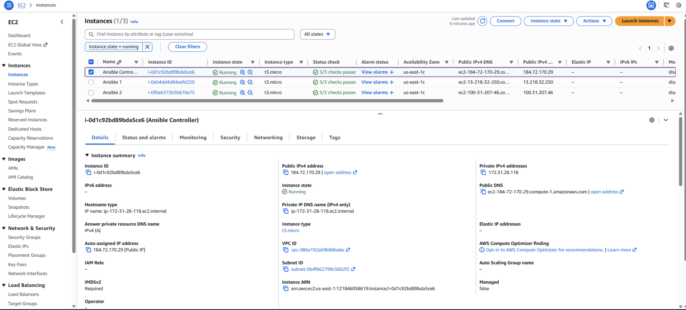

# Setting up Ansible on a Linux Server
Introduction
Ansible is a powerful automation tool that simplifies the management of IT infrastructure. Setting up Ansible on a Linux server is the first step toward leveraging its capabilities. This project will guide you through installing and configuring Ansible on a Linux server, allowing you to automate tasks and manage servers effectively.

## Objectives
Understand what Ansible is and how it works.
Install and configure Ansible on a Linux control node.
Set up SSH key-based authentication for target nodes.
Create an Ansible inventory file. Verify Ansible setup by running basic commands.
Prerequisites
Linux Machine: A Linux server or virtual machine to act as the control node.
Target Machine(s): At least one additional Linux server or virtual machine for Ansible to manage.
SSH Access: Access to target nodes with SSH.
Tools: Basic knowledge of the Linux command line and a text editor.
Tasks Outline
Install Ansible on the control node.
Configure SSH key-based authentication.
Create an inventory file for target machine(s).
Test Ansible connectivity to target machine(s).
Run a simple Ansible ad-hoc command.
Project Tasks

## Task 1 - Install Ansible on the Control Node
On this project, I will be using Ubuntu created on AWS and login to the ubuntu Linux server.

Login to the ubuntu server and update.

1. Update the package repository

sudo apt update

2. Install Ansible:

3. erify the installation:

ansible --version

The output should display the installed Ansible version like this:

ask 2 - Configure SSH Key-Based Authentication
Generate an SSH key pair on the control node:

ssh-keygen -t rsa

Press Enter to accept the default path and passphrase.

SSHKeygen

Copy the public key to the target machine(s):

Follow the steps below to generate keygen on the controller machine, copy the key to the Node server and access the Node server from the controller machine as below:

Login to access the controller server on AWS

cd ~/.ssh

 ls

ssh-keygen # this will generate the public id and private id

cat id_ed25519.pub #This would show the public id

Copy the public ID to the server you wanted to manage

Test SSH access without a password:

ssh ubuntu@98.93.9.134

keygen addkeytoNode logintoNodeServer

We have now successfully configured a passwordless SSH access.

Task 3 - Create an Inventory File
Create a directory for Ansible configuration:

mkdir ~/ansible cd ~/ansible

AnsibleFile

Create an inventory file:

vim inventory.ini

inventoryfile

Add target machine details to the inventory:

[linux_servers]

target1 ansible_host=98.93.9.134 ansible_user=ubuntu

AnsibleTarget

AnsibleTarget

Save and close the file.

Task 4 - Test Ansible Connectivity
Test Ansible connectivity to the target machines:

ansible -i inventory.ini linux_servers -m ping

Ansibleconnection

The output should show a pong response from each target machine.

Task 5 - Run a Simple Ansible Ad-Hoc Command
Run a command to check the uptime of target machines:

ansible -i inventory.ini linux_servers -m command -a "uptime"

AdHOC upimecommand

Run a command to check disk usage:

ansible -i inventory.ini linux_servers -m shell -a "df -h"

CommandforDishUsage

Observe the outputs to confirm successful execution.

Connection was successfully executed.

Conclusion
This project demonstrated how to set up Ansible on a Linux server and configure it to manage target machines. You installed Ansible, configured SSH access, created an inventory file, and verified connectivity using ad-hoc commands. With this foundation, you're now prepared to explore more advanced Ansible functionalities like writing playbooks and managing complex infrastructures.
