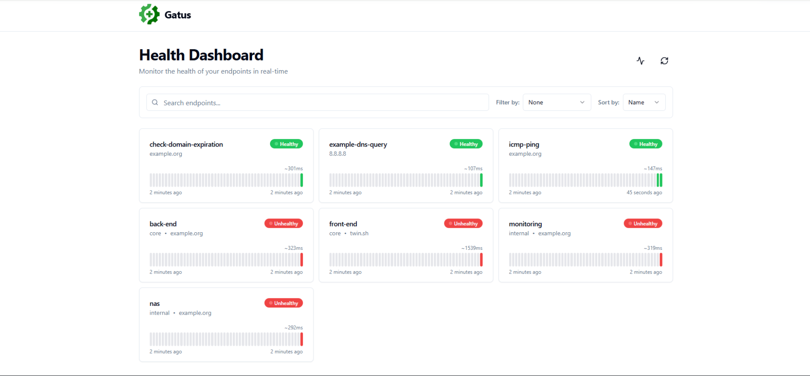

Configuring Uptime Monitoring using Gatus
Ensuring that our services and websites are available and performing as expected is crucial for maintaining user satisfaction and trust. Gatus is a simple yet powerful tool for monitoring the uptime of services and websites. This project will guide us through setting up Gatus to monitor the availability of a website or API endpoint and receive alerts when it becomes unavailable.

Objectives
Understand what Gatus is and its role in uptime monitoring.
Set up Gatus on your local machine or server.
Configure Gatus to monitor one or more endpoints.
Set up alerting for downtime events.
Visualize monitoring results through the Gatus dashboard.
Prerequisites
Basic Knowledge: Familiarity with HTTP services, APIs, and configuration files (YAML).

Tools Required:

A machine with Docker installed (recommended for ease of setup).
A text editor for editing configuration files.
Internet access for testing live endpoints.
Tasks Outline
Install and set up Gatus locally.
Create a basic configuration file to monitor endpoints.
Test the Gatus setup with live endpoints.
Configure alerts for downtime using Slack, email, or another notification method.
Explore and customize the Gatus dashboard.
Project Tasks
Task 1 - Install and Set Up Gatus Locally
Install Docker if it’s not already installed:

Follow the official Docker installation guide.https://docs.docker.com/get-docker/

I already have docker installed on my PC Docker

Pull the Gatus Docker image:

docker pull twinproduction/gatus

DockerPull

Create a directory for Gatus configuration:

mkdir gatus && cd gatus

gatusDir

Start Gatus using Docker with a basic setup:

docker run -d -p 8080:8080 --name gatus -v $(pwd)/config:/config twinproduction/gatus

StartGatusUsingDocker

DockerStarted

Access the Gatus dashboard in your browser at http://localhost:8080

GatusDashboard

Task 2 - Create a Basic Configuration File
Inside the gatus/config directory, create a config.yaml file.

configfile

Add a simple configuration to monitor a website:

configFile

sampleconfigfile

Restart the Gatus container to apply the configuration:

docker restart gatus

GatusRestart

ExampleEndPoint

Task 3 - Test the Setup with Live Endpoints
Add another endpoint to the config.yaml file for monitoring:

AnotherEndPoint

ConfigFile

Restart Gatus and verify the new endpoint appears on the dashboard.

docker restart gatus

GitHubEndPoint

Simulate a failure by adding a non-existent endpoint and observe the behavior:

Simulatefailure

Failure

4.Task 4 - Configure Alerts for Downtime
Choose an alerting method, such as Slack or email. For example, for Slack:

Create a Slack webhook URL in your workspace.
Add an alert configuration to config.yaml:

AlertConfig

Test the alerting by taking down a monitored service temporarily.

Task 5 - Explore and Customize the Gatus Dashboard
Access the Gatus dashboard to view uptime statistics for each endpoint.

DashBoard

Customize the dashboard appearance (e.g., themes, logos) by modifying the configuration file.

Adjust monitoring intervals and conditions to optimize performance.

Conclusion
In this project, we learned how to set up and configure Gatus for monitoring uptime and performance of services and websites. You explored essential features like endpoint monitoring, alerting, and dashboard visualization. With this knowledge, you can expand your configuration to monitor multiple services, integrate with advanced alerting tools, and deploy Gatus in production environments.

End.